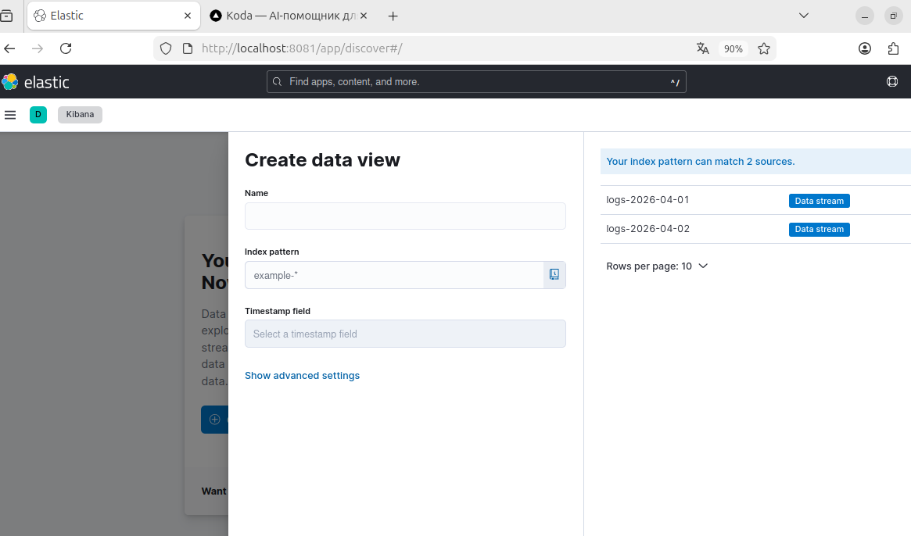

# Домашнее задание к занятию «Микросервисы: подходы». Шелухин Юрий.

Вы работаете в крупной компании, которая строит систему на основе микросервисной архитектуры.
Вам как DevOps-специалисту необходимо выдвинуть предложение по организации инфраструктуры для разработки и эксплуатации.

## Задача 1: Обеспечить разработку

Предложите решение для обеспечения процесса разработки: хранение исходного кода, непрерывная интеграция и непрерывная поставка. 
Решение может состоять из одного или нескольких программных продуктов и должно описывать способы и принципы их взаимодействия.

Решение должно соответствовать следующим требованиям:
- облачная система;
- система контроля версий Git;
- репозиторий на каждый сервис;
- запуск сборки по событию из системы контроля версий;
- запуск сборки по кнопке с указанием параметров;
- возможность привязать настройки к каждой сборке;
- возможность создания шаблонов для различных конфигураций сборок;
- возможность безопасного хранения секретных данных (пароли, ключи доступа);
- несколько конфигураций для сборки из одного репозитория;
- кастомные шаги при сборке;
- собственные докер-образы для сборки проектов;
- возможность развернуть агентов сборки на собственных серверах;
- возможность параллельного запуска нескольких сборок;
- возможность параллельного запуска тестов.

Обоснуйте свой выбор.

# 
Для обеспечения процесса разработки с требованиями к хранению исходного кода, непрерывной интеграции и непрерывной поставки (CI/CD) целесообразно использовать GitLab и облачную версию GitLab.com как единую платформу.

Обоснования:

GitLab (SaaS)
– Облачная система, предоставляющая хранение Git-репозиториев, CI/CD-пайплайны, управление секретами и шаблонами.

GitLab Runners
– Агенты сборки, которые могут быть развернуты на собственных серверах организации для выполнения задач, требующих специфического окружения или повышенной производительности.  
– Для облачной части используются также общие раннеры GitLab.com, но при необходимости вся нагрузка может быть перенаправлена на self-hosted раннеры.

Соответствие требованиям:  
- Облачная системаGitLab.com - полностью управляемый SaaS с высоким уровнем доступности.    
- Система контроля версий Git  - встроенный Git-репозиторий с поддержкой веток, тегов, merge request.    
- Репозиторий на каждый сервис - в GitLab каждый сервис создаётся как отдельный проект (Project).  
- Запуск сборки по событию из системы контроля версий - триггеры по push, созданию тега, merge request, комментариям и другим событиям через rules в .gitlab-ci.yml.  
- Запуск сборки по кнопке с указанием параметров - ручной запуск пайплайна с возможностью передачи переменных (CI/CD variables) через веб-интерфейс или API.  
- Возможность привязать настройки к каждой сборке - переменные окружения, environment, stage, rules позволяют задавать уникальные параметры для каждого запуска.  
- Возможность создания шаблонов для различных конфигураций сборок -использование include (локальные, удалённые шаблоны), extends, !reference, а также создание общих шаблонов в виде отдельных файлов.  
- Безопасное хранение секретных данных - защищённые переменные CI/CD (маскируются в логах, доступны только для защищённых веток/тегов).  
- Интеграция с HashiCorp Vault для динамических секретов.  
- Несколько конфигураций для сборки из одного репозитория- различные jobs с разными rules, only/except, использование parallel: matrix, динамическое создание jobs через trigger или generated.    
- Кастомные шаги при сборке - любые команды в script, поддержка shell, Python, Go и других интерпретаторов, возможность вызова пользовательских скриптов.  
- Собственные Docker-образы для сборки проектов - ключ image: позволяет использовать любой образ из публичного или приватного реестра (включая GitLab Container Registry).  
- Возможность развернуть агентов сборки на собственных серверах - GitLab Runner устанавливается на серверы организации, регистрируется в проекте/группе и выполняет задания с учётом тегов и правил.  
- Параллельный запуск нескольких сборок - пайплайны выполняются параллельно (ограничение задаётся на уровне проекта/раннеров). Self-hosted раннеры могут быть масштабированы.  
- Параллельный запуск тестов -parallel: в одном job для разбиения тестов на несколько параллельных задач, использование parallel: matrix для многомерного тестирования, а также разделение тестов по файлам с помощью artifacts и dependencies.  

---

## Задача 2: Логи

Предложите решение для обеспечения сбора и анализа логов сервисов в микросервисной архитектуре.
Решение может состоять из одного или нескольких программных продуктов и должно описывать способы и принципы их взаимодействия.

Решение должно соответствовать следующим требованиям:
- сбор логов в центральное хранилище со всех хостов, обслуживающих систему;
- минимальные требования к приложениям, сбор логов из stdout;
- гарантированная доставка логов до центрального хранилища;
- обеспечение поиска и фильтрации по записям логов;
- обеспечение пользовательского интерфейса с возможностью предоставления доступа разработчикам для поиска по записям логов;
- возможность дать ссылку на сохранённый поиск по записям логов.

Обоснуйте свой выбор.

#
Для обеспечения сбора и анализа логов в микросервисной архитектуре целесообразно использовать стек EFK (Elasticsearch, Fluent Bit, Kibana) с добавлением Apache Kafka в качестве буфера для гарантированной доставки. Это решение сочетает высокую производительность, масштабируемость и удобство работы с логами.

Обоснование:

Сбор логов:
- На каждом хосте (физическом или виртуальном, в кластере Kubernetes или без него) запускается Fluent Bit.
- Fluent Bit читает stdout контейнеров/приложений (например, через драйвер логирования Docker или из файлов /var/log/containers/*).
- Агент добавляет обязательные метаданные: host, service_name, namespace (если есть), container_id и др.
- Логи в структурированном (JSON) или неструктурированном виде отправляются в Kafka.

Минимальные требования:
- Приложения пишут только в stdout/stderr; никаких дополнительных библиотек или конфигураций не требуется.

Гарантированная доставка:
- Kafka настраивается с репликацией и подтверждением записи (acks=all).
- Fluent Bit использует буферизацию на диске и повторные попытки при недоступности Kafka.
- После записи в Kafka логи считаются доставленными; дальнейшие потребители могут обрабатывать их с любой задержкой.

Поиск и фильтрация:
- Elasticsearch индексирует логи и хранит их с учётом политик жизненного цикла (ILM).
- Kibana подключается к Elasticsearch, предоставляя разработчикам интерфейс с возможностью:
    полнотекстового поиска и фильтрации по любым полям;
    создания сохранённых поисков (Saved Searches);
    получения прямой ссылки на сохранённый поиск (Share → Permalink).

Пользовательский интерфейс:
- Kibana предоставляет пользовательский интерфейс с возможностью:
    поиска по записям логов;
    создания сохранённых поисков (Saved Searches);
    получения прямой ссылки на сохранённый поиск (Share → Permalink).
    разграничения прав; разработчики заходят в свой дашборд, строят запросы.

Возможность дать ссылку на сохранённый поиск по записям логов:
- Kibana позволяет сохранить поиск и получить постоянную ссылку (например, https://kibana.example.com/app/discover#/view/my_search), которая ведёт на тот же набор фильтров.

---

## Задача 3: Мониторинг

Предложите решение для обеспечения сбора и анализа состояния хостов и сервисов в микросервисной архитектуре.
Решение может состоять из одного или нескольких программных продуктов и должно описывать способы и принципы их взаимодействия.

Решение должно соответствовать следующим требованиям:
- сбор метрик со всех хостов, обслуживающих систему;
- сбор метрик состояния ресурсов хостов: CPU, RAM, HDD, Network;
- сбор метрик потребляемых ресурсов для каждого сервиса: CPU, RAM, HDD, Network;
- сбор метрик, специфичных для каждого сервиса;
- пользовательский интерфейс с возможностью делать запросы и агрегировать информацию;
- пользовательский интерфейс с возможностью настраивать различные панели для отслеживания состояния системы.

Обоснуйте свой выбор.

#
Для сбора и анализа метрик в микросервисной архитектуре целесообрахно использовать стек Prometheus + Grafana с набором экспортеров, обеспечивающий гибкий сбор метрик, мощные запросы и наглядную визуализацию.

Обоснование.

Сбор метрик хостов:
- На каждом хосте (физическом, виртуальном, узле кластера) запускается Node Exporter.
- Node Exporter собирает метрики состояния ресурсов (CPU, RAM, HDD, Network) и предоставляет HTTP-эндпоинт /metrics.
- Prometheus периодически (по расписанию) «вытягивает» метрики с этого эндпоинта в pull-модели.

Сбор метрик состояния ресурсов:
- Для каждого контейнера/сервиса запускается cAdvisor, который собирает потребление ресурсов (CPU, RAM, HDD, Network) на уровне контейнеров.
- В Kubernetes cAdvisor интегрирован в kubelet, метрики доступны через kubelet API; Prometheus может их забирать.
- Дополнительно kube-state-metrics предоставляет метрики о состоянии объектов Kubernetes (поды, деплойменты и т.д.), что полезно для привязки ресурсов к конкретным сервисам.

Сбор специфичных метрик сервисов:
- Разработчики интегрируют клиентскую библиотеку Prometheus (для Go, Java, Python, .NET и др.) в код приложения.
- Сервис выставляет HTTP-эндпоинт /metrics с кастомными метриками (например, http_requests_total, request_duration_seconds).
- Prometheus опрашивает эти эндпоинты так же, как и экспортеры.

Визуализация и аналитика*
- Grafana подключается к Prometheus как к источнику данных (DataSource).
- Администраторы и разработчики создают дашборды, используя язык запросов PromQL.
- Возможности:
    Агрегация данных (средние, процентили, суммы) по временным диапазонам.
    Построение графиков, тепловых карт, таблиц.
    Настройка алертов (через Alertmanager) и панелей для мониторинга SLO.

---

## Задача 4: Логи * (необязательная)

Продолжить работу по задаче API Gateway: сервисы, используемые в задаче, пишут логи в stdout. 
Добавить в систему сервисы для сбора логов Vector + ElasticSearch + Kibana со всех сервисов, обеспечивающих работу API.

### Результат выполнения: 

docker compose файл, запустив который можно перейти по адресу http://localhost:8081, по которому доступна Kibana.
Логин в Kibana должен быть admin, пароль qwerty123456.

#

---

## Задача 5: Мониторинг * (необязательная)

Продолжить работу по задаче API Gateway: сервисы, используемые в задаче, предоставляют набор метрик в формате prometheus:

- сервис security по адресу /metrics,
- сервис uploader по адресу /metrics,
- сервис storage (minio) по адресу /minio/v2/metrics/cluster.

Добавить в систему сервисы для сбора метрик (Prometheus и Grafana) со всех сервисов, обеспечивающих работу API.
Построить в Graphana dashboard, показывающий распределение запросов по сервисам.

### Результат выполнения: 

docker compose файл, запустив который можно перейти по адресу http://localhost:8081, по которому доступна Grafana с настроенным Dashboard.
Логин в Grafana должен быть admin, пароль qwerty123456.

---